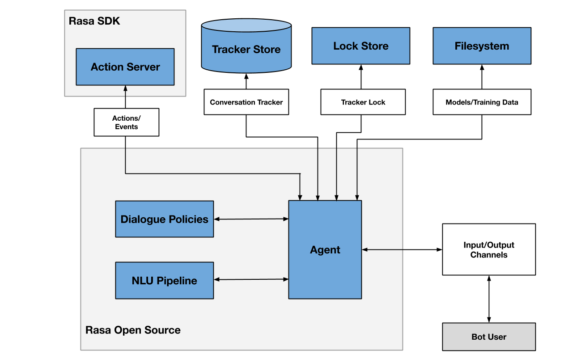

# euanka-rasa


### 架构
#### 官方架构
官方介绍：https://rasa.com/docs/rasa/arch-overview


### 安装

安装 conda python3.9

安装 rasa >3.4


```
#
# To activate this environment, use
#
#     $ conda activate rasa
#
# To deactivate an active environment, use
#
#     $ conda deactivate
```


安装rasa
pip install rasa==3.4.6 -i https://mirrors.tuna.tsinghua.edu.cn/pypi/web/simple/

rasa init

一直确认即可


安装spacy
pip install spacy==3.4.4 -i https://pypi.tuna.tsinghua.edu.cn/simple

下载spacy对应的模型

wget https://github.com/explosion/spacy-models/releases/download/zh_core_web_md-3.4.0/zh_core_web_md-3.4.0-py3-none-any.whl

安装作为依赖
pip install zh_core_web_md-3.4.0-py3-none-any.whl


### 训练

训练
rasa train

仅启动rasa nlu服务，指定使用的模型
rasa run --enable-api -m models/20230325-165522-metallic-inertia.tar.gz

curl localhost:5005/model/parse -d '{"text":"hello"}'

curl localhost:5005/model/parse -d '{"text":"今天深圳天气"}'


###  rasa 启动
语义
rasa run -vv --cors "*"

actions服务
rasa run actions


### docker 

#### rasa

rasa docker 镜像构建
```
docker build -t yfq/rasa:0.1 .
```

镜像运行，本地构建的包
```
docker run yfq/rasa:0.1
```


#### rasa-action

构建
```
docker build . -f Dockerfile_action  -t  yfq/rasa-action:0.1
```

运行
```
docker run yfq/rasa-action:0.1 
```

#### rasa 和 rasa-action 合并运行

官方参考操作：https://rasa.com/docs/rasa/docker/building-in-docker/

创建一个docker网络，使得两个docker容器可以自己内部连接

```
docker network create my-project
```

启动 action-sdk:
```
docker run -d --net my-project --name action-server yfq/rasa-action:0.1 
```

启动rasa
```
docker run -d -p 5005:5005 --net my-project yfq/rasa:0.1
```

### 测试
返回的是中文编码，确实存在暂时无法显示
```
curl -XPOST localhost:5005/webhooks/rest/webhook -H "Content-Type: application/json" -d '{"message":"今天深圳天气"}'
```
